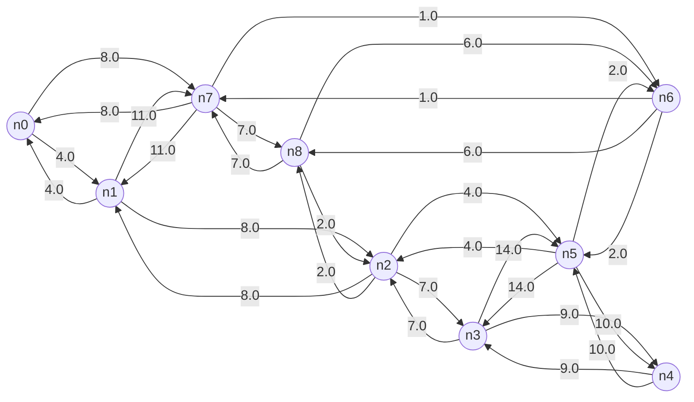

```mermaid
graph LR
n0((n0))
n1((n1))
n7((n7))
n2((n2))
n8((n8))
n6((n6))
n3((n3))
n5((n5))
n4((n4))
n0-->|4.0| n1
n0-->|8.0| n7
n1-->|4.0| n0
n1-->|11.0| n7
n1-->|8.0| n2
n7-->|8.0| n0
n7-->|11.0| n1
n7-->|7.0| n8
n7-->|1.0| n6
n2-->|8.0| n1
n2-->|7.0| n3
n2-->|2.0| n8
n2-->|4.0| n5
n8-->|7.0| n7
n8-->|2.0| n2
n8-->|6.0| n6
n6-->|1.0| n7
n6-->|6.0| n8
n6-->|2.0| n5
n3-->|7.0| n2
n3-->|14.0| n5
n3-->|9.0| n4
n5-->|4.0| n2
n5-->|2.0| n6
n5-->|14.0| n3
n5-->|10.0| n4
n4-->|9.0| n3
n4-->|10.0| n5
```

