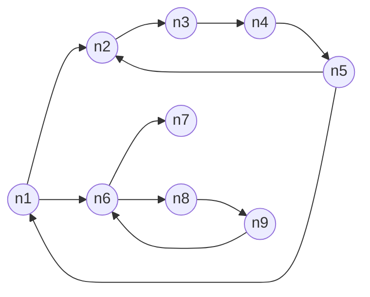
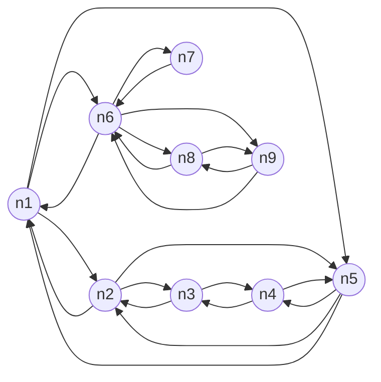

```mermaid
graph LR
n1((n1))
n2((n2))
n6((n6))
n3((n3))
n4((n4))
n5((n5))
n7((n7))
n8((n8))
n9((n9))
n1-->n2 & n6
n2-->n3
n6-->n7 & n8
n3-->n4
n4-->n5
n5-->n2 & n1
n8-->n9
n9-->n6
```

```mermaid
graph LR
n1((n1))
n2((n2))
n6((n6))
n3((n3))
n4((n4))
n5((n5))
n7((n7))
n8((n8))
n9((n9))
n1-->n2 & n6 & n5
n2-->n1 & n3 & n5
n6-->n1 & n7 & n8 & n9
n3-->n2 & n4
n4-->n3 & n5
n5-->n4 & n2 & n1
n7-->n6
n8-->n6 & n9
n9-->n8 & n6
```

